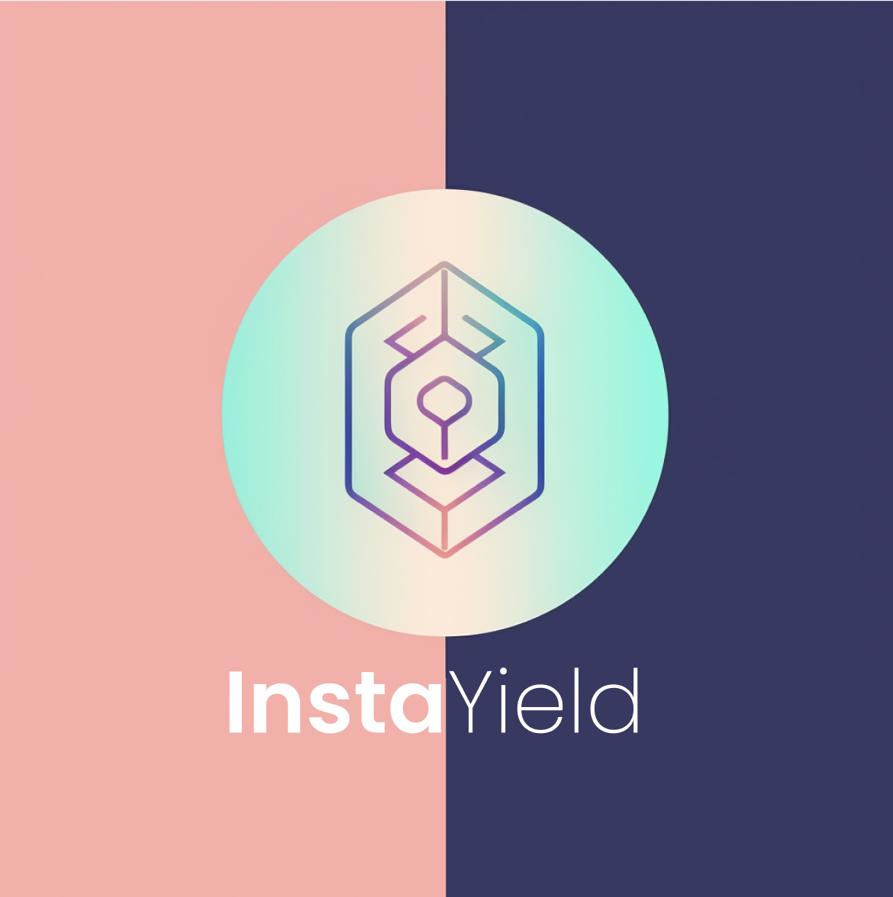

# InstaYield Contracts

This repo contains all the contracts related to the core InstaYield protocol.

- The InstaYield Protocol
- AAVEv2Strategy (USDC/DAI/etc)
- InstaYieldBack
- InstaYieldBackLM (liquidity mining)
- InstaYield Token
- InstaYield NFT

This repo was initialised using the Solidity template created by paulrberg: https://github.com/paulrberg/hardhat-template

- [Hardhat](https://github.com/nomiclabs/hardhat): compile and run the smart contracts on a local development network
- [TypeChain](https://github.com/ethereum-ts/TypeChain): generate TypeScript types for smart contracts
- [Ethers](https://github.com/ethers-io/ethers.js/): renowned Ethereum library and wallet implementation
- [Waffle](https://github.com/EthWorks/Waffle): tooling for writing comprehensive smart contract tests
- [Solhint](https://github.com/protofire/solhint): linter
- [Solcover](https://github.com/sc-forks/solidity-coverage): code coverage
- [Prettier Plugin Solidity](https://github.com/prettier-solidity/prettier-plugin-solidity): code formatter

# About InstaYield
InstaYield is a blockchain-based project that introduces the concept of "time traveling" with money. It allows users to receive the future value of their assets upfront, rather than waiting for yields to accrue over time. This innovative protocol leverages Time Vaults, which are custom smart contracts responsible for facilitating the buying, selling, and earning of TBDs (InstaYield's native tokens). Time Vaults utilize various types of pools, such as Yield Pools, Liquidity Pools, and Boost Pools, to generate upfront yield. These pools act as sources of yield that can be accessed by burning TBDs.

Real-world examples of InstaYield's functionality showcase its benefits. For instance, imagine Bob has $10,000 in a bank account earning $1 a day in interest. Instead of waiting for a year to access his accumulated interest, Bob can utilize "InstaYield" and instantly redeem $365. This provides Bob with immediate access to the future value of his money, retaining full control of his principal, and the option to unlock it entirely after a year. Additionally, if Bob needs to withdraw his $10,000 early, he can do so by paying back a decreasing percentage of the $365 upfront yield.

These examples demonstrate how InstaYield allows individuals to sell the future time value of their money for upfront capital, providing liquidity, flexibility, and control over their assets. By leveraging blockchain and Time Vaults, InstaYield revolutionizes traditional finance by enabling users to transcend time and access the future value of their assets today.

# Future
Governance and Voting: Introduce a governance mechanism where InstaYield token holders can participate in decision-making processes. This could involve voting on protocol upgrades, introducing new Time Vault strategies, or determining the allocation of platform fees.

Cross-Chain Compatibility: Explore interoperability with other blockchain networks to expand the reach of InstaYield. By connecting with multiple blockchains, users can have more options for staking and accessing upfront yields, regardless of the underlying blockchain technology.
